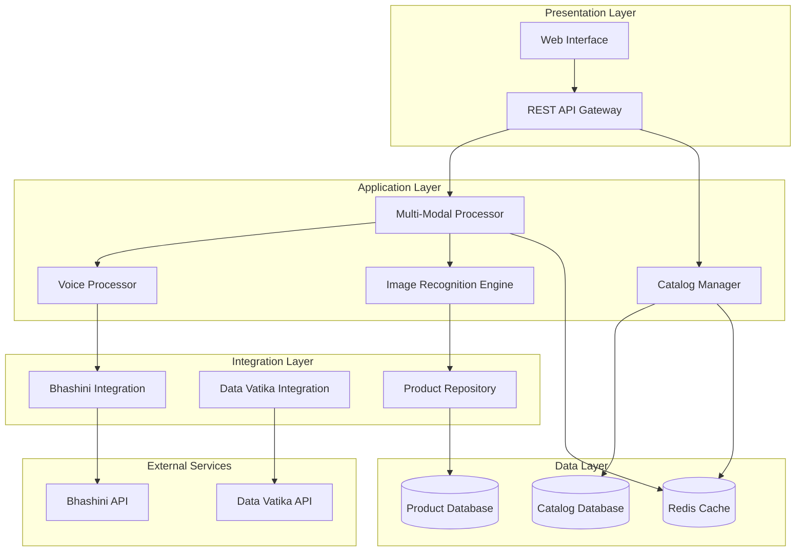

# Design Document: Shelfie Multi-Modal Product Catalog Platform

## Overview

Shelfie is a comprehensive multi-modal product catalog digitization platform that enables sellers to efficiently digitize large product catalogs using text, voice, and image inputs. The platform integrates with India's Bhashini model for multi-language support and data Vatika for enhanced data processing, supporting 10+ Indic languages and handling catalogs with 1000+ SKUs.

The system follows a microservices architecture with clear separation between input processing, data management, and external service integrations. The platform emphasizes real-time processing, intelligent pre-filling through image recognition, and seamless multi-modal input combination.

## Architecture

The Shelfie platform follows a layered microservices architecture designed for scalability, maintainability, and multi-modal input processing:



### Key Architectural Principles

1. **Microservices Design**: Each major component (voice processing, image recognition, catalog management) operates as an independent service
2. **Event-Driven Architecture**: Components communicate through events for loose coupling and scalability
3. **Multi-Modal Integration**: Unified processing pipeline that seamlessly combines text, voice, and image inputs
4. **External Service Abstraction**: Clean interfaces for Bhashini and Data Vatika integration with fallback mechanisms
5. **Horizontal Scalability**: Stateless services that can be scaled independently based on demand

## Components and Interfaces

### Multi-Modal Processor

The central orchestrator for handling different input types and coordinating data flow between components.

```typescript
interface MultiModalProcessor {
  processTextInput(text: string, language: string, productId: string): Promise<ProductData>
  processVoiceInput(audioData: ArrayBuffer, language: string, productId: string): Promise<ProductData>
  processImageInput(imageData: ArrayBuffer, productId: string): Promise<ProductData>
  combineInputs(inputs: InputData[], productId: string): Promise<ProductData>
  validateProductData(data: ProductData): ValidationResult
}

interface InputData {
  type: 'text' | 'voice' | 'image'
  content: string | ArrayBuffer
  language?: string
  confidence: number
  timestamp: Date
}
```

### Voice Processor

Handles voice input conversion to text using Bhashini integration with support for multiple Indic languages.

```typescript
interface VoiceProcessor {
  startRecording(): Promise<void>
  stopRecording(): Promise<ArrayBuffer>
  convertSpeechToText(audioData: ArrayBuffer, language: string): Promise<SpeechResult>
  detectLanguage(audioData: ArrayBuffer): Promise<string>
  processVoiceCommand(command: string): Promise<VoiceCommand>
}

interface SpeechResult {
  text: string
  confidence: number
  language: string
  alternatives: string[]
}
```

### Image Recognition Engine

Processes product images and matches against the product repository for intelligent pre-filling.

```typescript
interface ImageRecognitionEngine {
  extractProductInfo(imageData: ArrayBuffer): Promise<ImageAnalysisResult>
  matchProduct(features: ImageFeatures): Promise<ProductMatch[]>
  learnFromNewProduct(imageData: ArrayBuffer, productInfo: ProductData): Promise<void>
  optimizeImage(imageData: ArrayBuffer): Promise<ArrayBuffer>
}

interface ImageAnalysisResult {
  extractedText: string[]
  detectedObjects: DetectedObject[]
  features: ImageFeatures
  quality: ImageQuality
}

interface ProductMatch {
  productId: string
  productName: string
  confidence: number
  similarity: number
}
```

### Catalog Manager

Manages product catalogs, SKU operations, and bulk processing capabilities.

```typescript
interface CatalogManager {
  createCatalog(sellerId: string, catalogInfo: CatalogInfo): Promise<Catalog>
  addProduct(catalogId: string, productData: ProductData): Promise<Product>
  updateProduct(productId: string, updates: Partial<ProductData>): Promise<Product>
  bulkImport(catalogId: string, products: ProductData[]): Promise<BulkImportResult>
  searchProducts(catalogId: string, query: SearchQuery): Promise<Product[]>
  exportCatalog(catalogId: string, format: ExportFormat): Promise<ExportResult>
}

interface BulkImportResult {
  totalProcessed: number
  successful: number
  failed: number
  errors: ImportError[]
  processingTime: number
}
```

### Bhashini Integration

Interface for connecting with India's Bhashini model for language processing.

```typescript
interface BhashiniIntegration {
  translateText(text: string, fromLang: string, toLang: string): Promise<TranslationResult>
  convertSpeechToText(audioData: ArrayBuffer, language: string): Promise<SpeechResult>
  detectLanguage(text: string): Promise<LanguageDetectionResult>
  getSupportedLanguages(): Promise<string[]>
}

interface TranslationResult {
  translatedText: string
  confidence: number
  sourceLanguage: string
  targetLanguage: string
}
```

### Data Vatika Integration

Interface for enhanced data processing using Data Vatika capabilities.

```typescript
interface DataVatikaIntegration {
  enhanceProductData(productData: ProductData): Promise<EnhancedProductData>
  validateProductInfo(productData: ProductData): Promise<ValidationResult>
  extractInsights(catalogData: CatalogData): Promise<CatalogInsights>
  normalizeData(rawData: any): Promise<NormalizedData>
}

interface EnhancedProductData extends ProductData {
  suggestedCategories: string[]
  marketInsights: MarketInsight[]
  qualityScore: number
  completenessScore: number
}
```

## Data Models

### Core Product Data Model

```typescript
interface ProductData {
  skuId: string
  productName: string
  description: string
  price: number
  currency: string
  images: ProductImage[]
  inventory: InventoryInfo
  attributes: ProductAttributes
  metadata: ProductMetadata
}

interface ProductAttributes {
  colour?: string
  size?: string
  brand: string
  category: string
  weight?: number
  dimensions?: Dimensions
  customAttributes: Record<string, any>
}

interface ProductImage {
  url: string
  alt: string
  isPrimary: boolean
  quality: ImageQuality
  source: 'upload' | 'camera' | 'url'
}

interface InventoryInfo {
  quantity: number
  lowStockThreshold: number
  status: 'in_stock' | 'low_stock' | 'out_of_stock'
  lastUpdated: Date
}
```

### Catalog Data Model

```typescript
interface Catalog {
  catalogId: string
  sellerId: string
  name: string
  description: string
  products: Product[]
  metadata: CatalogMetadata
  createdAt: Date
  updatedAt: Date
}

interface CatalogMetadata {
  totalProducts: number
  categories: string[]
  languages: string[]
  completionStatus: number
  lastSyncDate: Date
}
```

### Multi-Modal Input Session

```typescript
interface InputSession {
  sessionId: string
  productId: string
  sellerId: string
  inputs: InputData[]
  currentState: ProductData
  completionStatus: CompletionStatus
  startTime: Date
  lastActivity: Date
}

interface CompletionStatus {
  requiredFields: string[]
  completedFields: string[]
  missingFields: string[]
  validationErrors: ValidationError[]
}
```

### Language and Localization

```typescript
interface LanguageSupport {
  languageCode: string
  languageName: string
  isSupported: boolean
  voiceSupport: boolean
  textSupport: boolean
  uiSupport: boolean
}

interface LocalizedContent {
  language: string
  content: Record<string, string>
  fallbackLanguage: string
}
```

## Correctness Properties

*A property is a characteristic or behavior that should hold true across all valid executions of a system—essentially, a formal statement about what the system should do. Properties serve as the bridge between human-readable specifications and machine-verifiable correctness guarantees.*

Based on the requirements analysis, the following correctness properties ensure the Shelfie platform operates correctly across all scenarios:

### Property 1: Large Catalog Processing Performance
*For any* catalog with 1000+ SKUs, processing should complete successfully within acceptable time limits (5 seconds per SKU) without performance degradation, maintaining 99.9% data persistence reliability.
**Validates: Requirements 1.1, 1.2, 1.4**

### Property 2: Concurrent Operation Support  
*For any* set of up to 10 simultaneous catalog upload operations, all operations should complete successfully without interference or data corruption.
**Validates: Requirements 1.3**

### Property 3: Product Attribute Validation
*For any* product data, all required attributes (SKU id, name, description, price, image, inventory, colour, size, brand) must be present and properly formatted before successful save operations, with specific error messages for validation failures.
**Validates: Requirements 2.1, 2.2, 2.3, 2.5**

### Property 4: Custom Attribute Support
*For any* custom attribute field added beyond the core set, the system should store, retrieve, and validate the custom data correctly.
**Validates: Requirements 2.4**

### Property 5: Multi-Modal Input Processing
*For any* combination of text, voice, and image inputs for a single product, the system should accept all input types, preserve data when switching between modes, and successfully combine inputs to complete product entries.
**Validates: Requirements 3.1, 3.2, 3.3, 3.4, 3.5**

### Property 6: Indic Language Text Processing
*For any* text input in supported Indic languages, the system should handle language-specific characters and formatting correctly, with proper UI localization.
**Validates: Requirements 4.3, 4.4**

### Property 7: Voice Recognition Accuracy
*For any* voice input in supported Indic languages, speech-to-text conversion should achieve at least 95% accuracy, with real-time processing and proper handling of multiple speakers and accents.
**Validates: Requirements 4.2, 7.2, 7.5**

### Property 8: Image Recognition and Pre-filling
*For any* uploaded product image, the system should attempt matching against the product repository, pre-fill product names when matches are found, present options for multiple matches, and achieve at least 80% accuracy for common products.
**Validates: Requirements 5.1, 5.2, 5.3, 5.5**

### Property 9: Learning from New Products
*For any* unmatched product image, the system should allow manual entry while learning from the new product data to improve future matching.
**Validates: Requirements 5.4**

### Property 10: External Service Integration Reliability
*For any* external service call (Bhashini, Data Vatika), the system should handle authentication, implement retry mechanisms with exponential backoff on failures, and queue requests when rate limits are reached.
**Validates: Requirements 6.1, 6.3, 6.5**

### Property 11: Data Enhancement and Caching
*For any* product data processed through Data Vatika integration, enhancement should occur correctly, and frequently accessed data should be cached to improve performance.
**Validates: Requirements 6.2, 6.4**

### Property 12: Voice Command Navigation
*For any* voice command for field navigation, the system should correctly interpret and execute the navigation, with confirmation requests for low-confidence recognition.
**Validates: Requirements 7.3, 7.4**

### Property 13: Audio Capture Quality
*For any* audio input, the system should capture from microphone with noise cancellation applied.
**Validates: Requirements 7.1**

### Property 14: Multi-Modal Data Consistency
*For any* product entry using multiple input modalities, data consistency should be maintained, conflicts should prompt for user resolution, and visual indicators should show which method filled each attribute.
**Validates: Requirements 8.2, 8.3, 8.4**

### Property 15: Input Method Flexibility
*For any* product attribute, the system should allow switching between text, voice, and image input methods, with validation ensuring completeness regardless of input method used.
**Validates: Requirements 8.1, 8.5**

### Property 16: Catalog CRUD Operations
*For any* catalog management operation (create, edit, delete), the operation should complete successfully with proper data persistence and integrity.
**Validates: Requirements 9.1**

### Property 17: Search and Export Functionality
*For any* search query across product attributes, results should be accurate and complete, and catalog exports should work correctly in multiple formats (CSV, JSON, Excel).
**Validates: Requirements 9.2, 9.3**

### Property 18: Version Control and Bulk Operations
*For any* catalog modification, history should be tracked correctly, and bulk operations should provide progress indicators with cancellation capability.
**Validates: Requirements 9.4, 9.5**

### Property 19: Performance Under Load
*For any* system load condition, individual SKU processing should complete within 3 seconds under normal load, with graceful performance degradation under increased load.
**Validates: Requirements 10.1, 10.2**

### Property 20: Scalability and Optimization
*For any* increased user demand, the system should support horizontal scaling, optimize large image processing without sacrificing accuracy, and implement effective caching strategies.
**Validates: Requirements 10.3, 10.4, 10.5**

## Error Handling

The Shelfie platform implements comprehensive error handling across all components:

### Input Processing Errors
- **Voice Recognition Failures**: When voice-to-text conversion fails or confidence is low, the system prompts for re-recording or manual input
- **Image Processing Errors**: When image recognition fails, the system gracefully falls back to manual entry while logging the failure for system improvement
- **Language Detection Failures**: When automatic language detection fails, the system prompts users to specify the input language

### External Service Errors
- **Bhashini API Failures**: Implement circuit breaker pattern with exponential backoff retry mechanism
- **Data Vatika Integration Errors**: Graceful degradation with local processing fallback when enhancement services are unavailable
- **Network Connectivity Issues**: Queue operations locally and sync when connectivity is restored

### Data Validation Errors
- **Missing Required Fields**: Clear, specific error messages indicating which fields need completion
- **Format Validation Failures**: Detailed feedback on expected formats with examples
- **Duplicate SKU Detection**: Prevent duplicate entries with clear resolution options

### Performance and Scalability Errors
- **Resource Exhaustion**: Implement graceful degradation with priority queuing for critical operations
- **Concurrent Access Conflicts**: Use optimistic locking with conflict resolution mechanisms
- **Large File Processing**: Implement chunked processing with progress indicators and timeout handling

## Testing Strategy

The Shelfie platform requires a comprehensive testing approach combining unit tests and property-based tests to ensure correctness across all scenarios.

### Property-Based Testing Configuration

All property-based tests will use **fast-check** (for TypeScript/JavaScript implementation) with the following configuration:
- **Minimum 100 iterations** per property test to ensure comprehensive input coverage
- **Timeout of 30 seconds** per property test to handle complex multi-modal scenarios
- **Shrinking enabled** to find minimal failing examples when tests fail
- **Seed-based reproducibility** for consistent test results across environments

Each property test must be tagged with a comment referencing its design document property:
```typescript
// Feature: shelfie, Property 1: Large Catalog Processing Performance
```

### Unit Testing Strategy

Unit tests complement property-based tests by focusing on:

**Specific Examples and Edge Cases:**
- Empty catalog processing
- Single SKU operations
- Boundary conditions (exactly 1000 SKUs, maximum file sizes)
- Language-specific character handling edge cases

**Integration Points:**
- Bhashini API integration with mock responses
- Data Vatika integration with various response scenarios
- Database connection and transaction handling
- Cache invalidation and consistency

**Error Conditions:**
- Network timeouts and service unavailability
- Malformed input data and corrupted files
- Authentication failures and rate limiting
- Concurrent access conflicts

### Testing Coverage Requirements

**Multi-Modal Input Testing:**
- Generate random combinations of text, voice, and image inputs
- Test input switching scenarios with data preservation
- Validate conflict resolution between different input sources

**Language Support Testing:**
- Test all 10+ supported Indic languages with representative text samples
- Validate voice recognition accuracy across different accents and speakers
- Ensure UI localization works correctly for all supported languages

**Performance Testing:**
- Load testing with catalogs of varying sizes (100, 1000, 5000+ SKUs)
- Concurrent user simulation with realistic usage patterns
- Memory and CPU usage monitoring during large operations

**External Service Integration Testing:**
- Mock Bhashini and Data Vatika services for consistent testing
- Simulate various failure scenarios and recovery mechanisms
- Test rate limiting and queuing behavior under different load conditions

The testing strategy ensures that both individual components work correctly (unit tests) and that the system maintains its correctness properties across all possible inputs and scenarios (property-based tests).